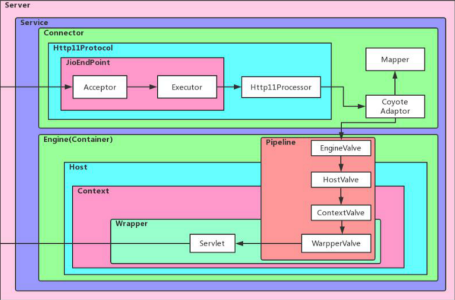
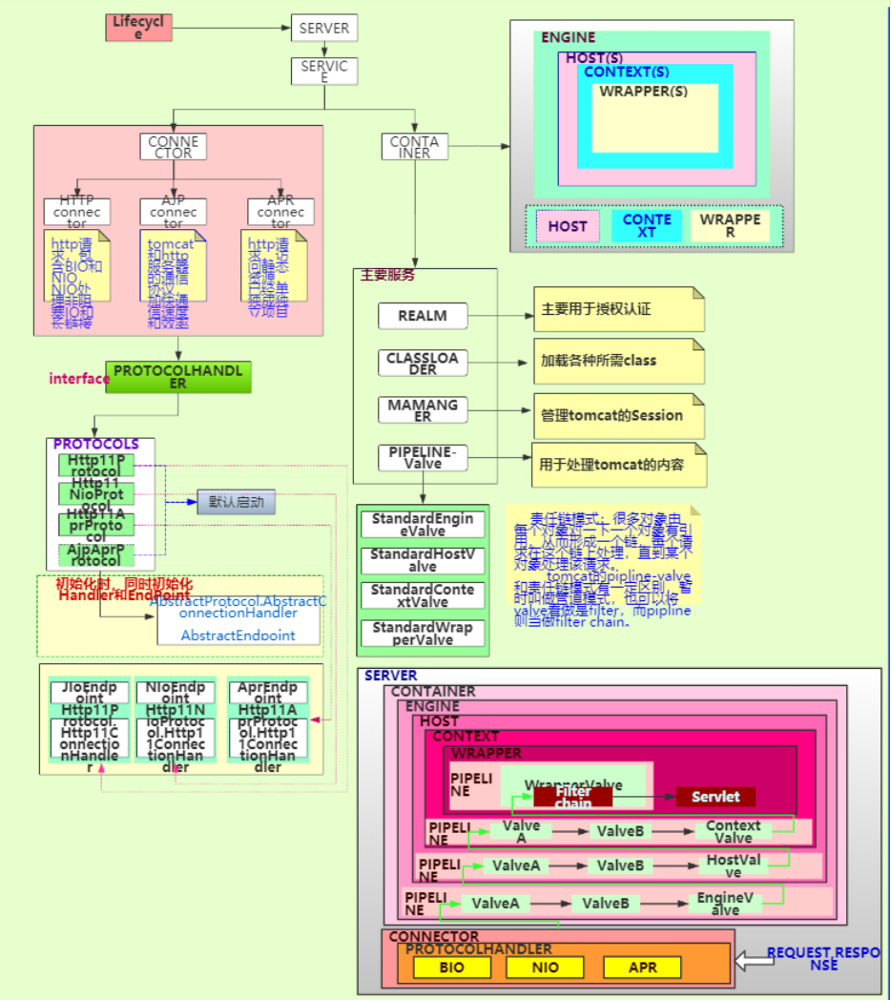

# Tomcat8-Source-Read
[](https://github.com/chenmudu/Tomcat8-Source-Read/blob/master/LICENSE)
[](https://github.com/chenmudu/Tomcat8-Source-Read/stargazers)
[](https://github.com/chenmudu/Tomcat8-Source-Read/network)
[](https://github.com/chenmudu/Tomcat8-Source-Read/issues)
[](https://codeload.github.com/chenmudu/Tomcat8-Source-Read/zip/master)

> 💪 Tomcat8-Source-Read(源码解读)

当你遇到以下类似问题时，`Tomcat8-Source-Read`可以帮你：

0. 想系统的读一个开源软件的源码，但是不知道该读哪个开源项目。
0. 读源码英文水平有限，每次需要借助翻译软件的生涩翻译才能持续Debug读下去，但是翻译的时候又浪费了巨多时间。
0. 想去读Tomcat的代码，一部分原因是网上关于Tomcat源码大多为Tomcat5/6/7的源码。另一部分因为代码结构复杂，不知道如何下手。
0. 从Tomcat官网下载了对应的代码，但是不知道如何基于Maven和IDEA去构建自己的源码。

`Tomcat8-Source-Read`基于Maven + IDEA，通过配置少量启动参数去构建。内置主要功能源码的中英翻译，持续更新个人的读源码感想。以及持续更新类结构图和关键逻辑的流程图。
> ☞微型架构图


---
> ☞详细整体架构图


---
> ☞目录说明
```
├─apache-tomcat-8.5.49-src tomcat源码(内部包含源码流程注释及中英文翻译)模块
│  
├─catalina-home   catallina配置(整个项目调试及tomcat优化的配置模块)
│  
├─common-api    公共Api模块(预计会为Tomcat做额外功能添加)
│       ├─src
│ 	        ├─main
│  		      ├─java
│ 		          ├─org
│                  │  └─chenchen
│                  │      └─customer 定制化线程池,模拟tomcat和Dubbo。
│                  │
│                  └─org.chenchen.test
│                          LogConstantForCode.java
│  	      
└─common-doc    公共文档模块,目前包括:
                                1.Servlet 3.1规范文档(中文)
                 预计后期增加:1.源码导读文档和时序图.
                             2.源码导读流程图.
                             3.感兴趣的一些源码极致分析.
                             4.源码精髓分析.
                    
```
> ☞更新列表

| 更新编号   | 日期       | 更新内容 | 更新人   | 标识     |
| :----:     | :----:     | :----:   | :----:   | :-----   |
|    ...     |  ...       | ...      |  陈晨    |  ...  |
|0000 0000 1011| 2020.01.01 | [定制I/O密集线程池](https://github.com/chenmudu/Tomcat8-Source-Read/tree/master/common-api/src/main/java/org/chenchen/customer )   | 陈晨   |  FangZhiCheng-Station  |
|0000 0000 1100| 2020.01.02 | [线程池对比文档](https://github.com/chenmudu/Tomcat8-Source-Read/tree/master/common-doc/doc/2-custom-executor.md )   | 陈晨   |  BanPo-Station  | 
|0000 0000 1101| 2020.01.09 | [架构图和注释修改](https://github.com/chenmudu/Tomcat8-Source-Read/commit/fe7ddf3a9ec66c66da78e0844f5e68c5e9aeea96)   | 陈晨   |  ChanHe-Station  | 
|0000 0000 1110| 2020.01.16 | [线程池功能修补](https://github.com/chenmudu/Tomcat8-Source-Read/commit/c01364e95b442820b612b87b6a7a67411a110629)   | 陈晨   |  ChangLePo-Station  | 
|0000 0000 1111| 2020.01.18 | [线程池优雅关闭](https://github.com/chenmudu/Tomcat8-Source-Read/pull/39/commits/95de0359548b830b0370500857548eaee64bcf99)   | 陈晨   |  WanShouLu-Station  |
|    ...     |  ...       | ...      |  陈晨    |  ...  |

> ☞ 预计目标 & 目前进度

- [x] 🍉 Tomcat源码构建
- [x] 🍎 源码导读及注释
- [ ] 🍓 源码导读流程图(准备中...)
- [ ] 🍍 源码导读文档(准备中...)
- [ ] 🍌 源码精髓分析(准备中...)
- [ ] 🥑 为容器增加扩展功能(准备中...)
- [ ] 🌤 ...待增加

## ☞ 快速开始

0.下载源码包 🍉

```sh
git clone -b branch-chenchen  git@github.com:chenmudu/Tomcat8-Source-Read.git
```
1.选择构建工具和调试工具 🍓

```sh
Maven + IDEA
```

2 点击Edit Configurations,选择Application构建项目 🍍

```sh
Maven + IDEA
```
3 修改Main class参数值为(启动入口) 🍌

```sh
org.apache.catalina.startup.Bootstrap
```

4 修改Vm options参数值为(调试和源码分开) 🍎

```sh
-Dcatalina.home=catalina-home 
-Dcatalina.base=catalina-home 
-Djava.endorsed.dirs=catalina-home/endorsed 
-Djava.io.tmpdir=catalina-home/temp 
-Djava.util.logging.manager=org.apache.juli.ClassLoaderLogManager 
-Djava.util.logging.config.file=catalina-home/conf/logging.properties
```

5 Run Application 🥑

```sh
Web Browser keys：localhost:8080/TestTomcatServlet/FirstServlet
```
6 选择感兴趣的模块调试读源码即可。如果出现乱码，请点击 🍅
```sh
catalina-home/conf/logging.properties 文件内修改对应参数.
```

## ☞ 维护者 ❤

[@陈晨(chenchen6)](https://github.com/chenmudu).

## ☞ 如何贡献(中英翻译,源码解读感想)  💪 

非常欢迎你的加入! [提一个Issue](https://github.com/chenmudu/Tomcat8-Source-Read/issues/new) 或者提交一个 Pull Request.