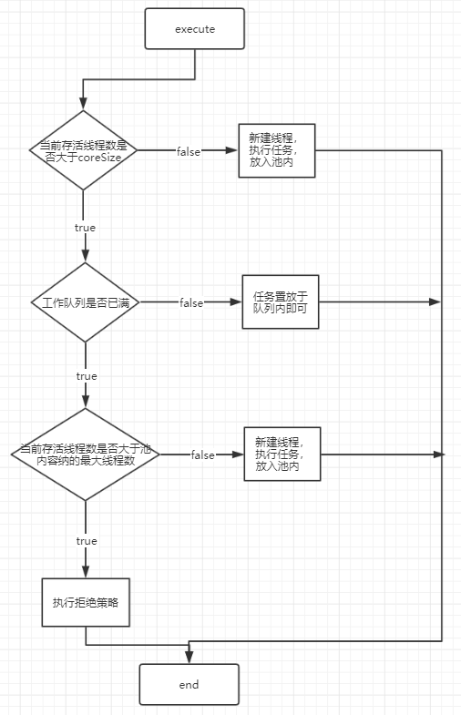
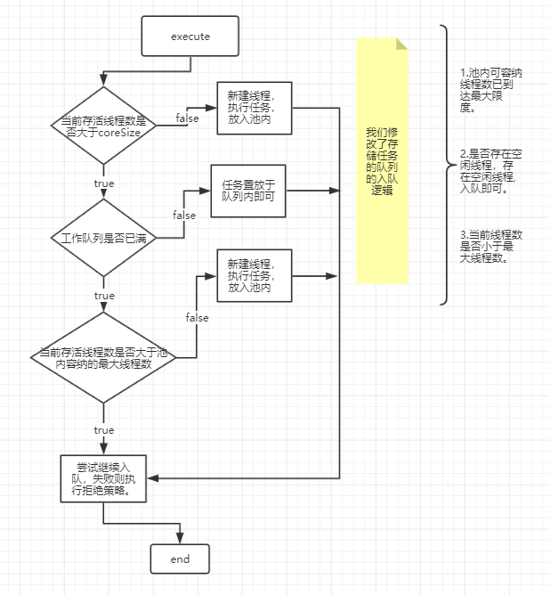

# 
### 线程池预备知识 🍎:

#### 线程昂贵的原因🍓:
  - 进程作为OS最小的资源分配和调度单位。
  - 而线程则是最小的执行单位.意味着逻辑的处理都伴随着线程的执行.
  - 线程生命周期内发生的事件伴随着系统函数的调用(用户态和和心态的切换)。
  - 用户态和核心态的频繁切换会影响到部署在其上的业务系统。
  - Java的线程借助于JVM线程(1.5以后)，而JVM线程又依托于C++去调用系统函数去创建。一个线程占用系统的资源与调用栈的大小有关.
  - JDK1.5线程池出现的时间：2004年09月30日。请参考摩尔定律。
#### 昂贵线程优化方案:
  - 采用创建代价比线程更小的协程去替换。(协程库)
  - 预先缓存部分线程，减少系统瞬间的压力(线程池)。
#### 任务的分类：
   将线程所执行的任务按照需要消耗的系统资源划分为：
   - Cpu密集型任务: 执行此任务大多时间下都在进行流程的转发或者数据的计算以及指令的跳动.即：Cpu处于极大的消耗下的任务。故此成为Cpu密集型任务。
   - I/O密集型任务: 执行此任务Cpu大多都在等待或闲置.而系统处理I/O阻塞中。此时Cpu并没有消耗过多，所以原生的JDK线程池是不适合目前的大多数业务开发情况。

#### 线程池实现🍍：
  1. 请参考java.util.concurrent.ThreadPoolExecutor线程池的相关逻辑和代码(JDK原生父线程池)。
  2. 请参考org.springframework.scheduling.concurrent.ThreadPoolTaskExecutor线程池相关逻辑和代码(Spring异步任务默认线程池)。
  3. 请参考org.springframework.core.task.SimpleAsyncTaskExecutor线程池相关逻辑和代码(Mq监听异步线程池)。
  &nbsp; &nbsp;  在有感知或者无感知的情况下,都存在任务的执行以及线程池的调度.而往往任务类型的划分并不是绝对的划分，往往Cpu密集型任务也伴随着部分系统I/O的消耗，而I/O密集型任务也伴随着Cpu的调度和轮转.所以是否选择定制化的时候请考虑二者所占的比例和适用的场景。

---
### 定制化I/O密集型线程池 🍌:
  1.  是什么让我觉得需要定制化一个线程池？
    &nbsp;  业务开发中,在异步任务中使用了Spring的线程池。当我梳理我的业务场景后,我发现当前使用的线程池(公司内部封装了Spring的ThreadPoolTaskExecutor, 而ThreadPoolTaskExecutor内部又是使用的JDK的线程池，这种线程池适用Cpu密集型任务)并不适合我的任务。
    
    
  2.  自定义的线程池解决了我什么样的需求？
    -  线程池所执行的任务类型 I/O密集型占大比例。
    -  Cpu大多处于空闲,系统资源未充分利用。
  3.  和JDK的线程池的对比是什么?
    - 修改了线程池的部分处理逻辑。
    - 修改了阻塞任务队列的入队逻辑。

---

###  与JDK线程池核心逻辑对比🍊：

- JDK线程池处理逻辑图：

- Custom线程池处理逻辑图：

- 逻辑对比关键点请查阅 [定制线程池](https://github.com/chenmudu/Tomcat8-Source-Read/tree/master/common-api/src/main/java/org/chenchen/customer ) 。
- 测试结果请查阅[定制线程池测试](https://github.com/chenmudu/Tomcat8-Source-Read/tree/master/common-api/src/test/java/org/chechen/executor ) 。
---

